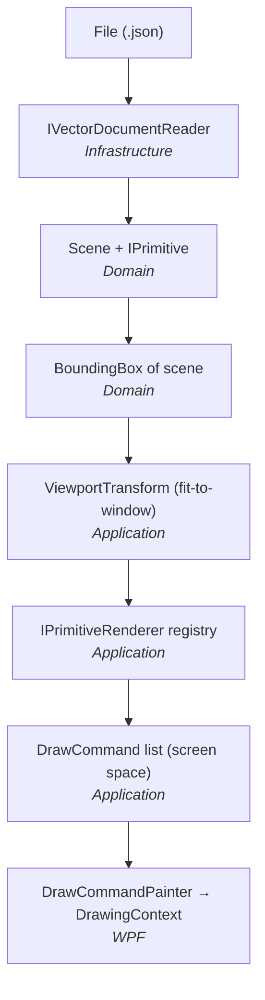

# Architecture

## 1. Goal

Read vector primitives from a file, transform them from Cartesian world space into screen
space, and draw them — while keeping the three extension points named in the challenge
(new primitive, new input format, selection) cheap to implement.

The design principle throughout: **the pipeline is a sequence of small, pure transformations**,
and only the last step knows about WPF.

## 2. Pipeline



Everything above the last box is plain .NET with no UI dependency and is unit-tested
without instantiating a single WPF type.

## 3. Projects

| Project | Responsibility | Depends on |
| --- | --- | --- |
| `VectorViewer.Domain` | Geometry values (`Point2D`, `BoundingBox`, `ArgbColor`), the `IPrimitive` abstraction, its implementations, and `Scene`. Pure, immutable, no I/O. | — |
| `VectorViewer.Application` | Use cases and policy: viewport/scale-to-fit math, the format-agnostic render model (`DrawCommand`), the primitive→command renderers, and the loader port `IVectorDocumentReader`. | Domain |
| `VectorViewer.Infrastructure` | The JSON adapter: DTO mapping, the `"x; y"` / `"a; r; g; b"` text parsers, reader selection by file extension. | Application, Domain |
| `VectorViewer.Wpf` | Presentation only: `SceneView` control, `MainViewModel`, painting `DrawCommand`s onto a `DrawingContext`, file dialog, composition root. | Infrastructure, Application, Domain |

Four projects, four genuinely different reasons to change. No layer was created merely to
have a layer — see [ADR-0001](adr/0001-architecture.md).

## 4. Key design decisions

### 4.1 `IPrimitive` is deliberately thin

```csharp
public interface IPrimitive
{
    ArgbColor Color { get; }
    BoundingBox Bounds { get; }
}
```

A primitive knows its colour and its extent. It does **not** know how to draw itself —
that would drag rendering concepts into the domain and make the domain untestable in
isolation. `Filled` lives on a separate `IFillablePrimitive` interface because it is not
universal: a `Line` has no interior, and modelling `Filled` on the base type would force
every future primitive to carry a meaningless flag.

Concrete primitives are `sealed record`s: value equality makes tests read well, and
immutability means a `Scene` can compute its bounds once in its constructor and cache it.

### 4.2 Rendering: a registry, not a visitor

A visitor makes *adding an operation* cheap and *adding a type* expensive — every new
primitive forces a change to the visitor interface and to every implementation. The
challenge asks for the opposite: adding **Rectangle** must be cheap.

So dispatch is a registry keyed by primitive type:

```csharp
PrimitiveRendererRegistry
    .CreateDefault()                       // line, circle, triangle
    .Register(new RectangleRenderer());    // ← the whole cost of a new primitive
```

`SceneRenderer` looks the renderer up by `primitive.GetType()`; nothing else in the
system contains a `switch` over primitive types. Adding a primitive touches: one new
domain record, one new renderer, one registration line. No existing file changes behaviour.

### 4.3 An intermediate render model

Renderers do not draw. They emit `DrawCommand`s — a tiny, closed vocabulary in
**screen coordinates**:

* `DrawLine(Start, End, Appearance)`
* `DrawEllipse(Center, RadiusX, RadiusY, Appearance)`
* `DrawPolygon(Points, Appearance)`

`Appearance` is `(Stroke? Stroke, ArgbColor? Fill)` — a `null` fill *is* `filled: false`.
`RenderContext.AppearanceFor(primitive)` applies that rule once for every primitive, so no
renderer re-implements it and a new primitive inherits the correct behaviour for free.

This is the seam that makes rendering testable without WPF: a test asserts that a filled
triangle produces one `DrawPolygon` with three transformed points, a stroke, and a fill.

The two vocabularies are intentionally asymmetric:

* **primitives are open** — expect many more,
* **draw commands are closed** — three shapes already express rectangle, polyline, polygon
  and arc-free geometry, and any renderer may emit several commands to compose a shape.

That asymmetry is why the small `switch` inside `DrawCommandPainter` is acceptable: it is
bounded by a vocabulary that is not expected to grow, and it is the only place in the
codebase that touches `DrawingContext`.

### 4.4 World space vs screen space

`ViewportTransform` is the single owner of the conversion and is a pure value:

```csharp
ScreenPoint ToScreen(Point2D world);   // Cartesian, Y-up  →  device, Y-down
Point2D     ToWorld(ScreenPoint p);    // inverse — the basis for future hit-testing
double      ToScreenLength(double worldLength);
```

`ViewportTransform.Fit(bounds, viewport, options)` computes it:

1. `scale = min(viewport.Width / bounds.Width, viewport.Height / bounds.Height)` —
   one uniform factor for both axes, so **aspect ratio is preserved**;
2. clamped to `MaximumScale` (default `1.0`), so a small drawing is **not** blown up —
   100 % zoom means 1 unit = 1 pixel, as specified;
3. the world bounds centre is mapped to the viewport centre, which **centres** the scene
   and handles negative coordinates and origin-crossing scenes with no special cases;
4. `Padding` (default 8 px) is reserved on each side so a 1-unit border stroke on a shape
   at the very edge of the drawing is not clipped.

Y inversion is a single sign in `ToScreen`. Degenerate input (zero width, zero height, or
an empty scene) is handled explicitly rather than producing `Infinity`/`NaN`.

Because the transform is a value object rather than a mutable service, the future zoom/pan
feature is `transform with { Scale = ... }` plus a pan offset — not a redesign.

### 4.5 Input: a port with extension-based selection

```csharp
public interface IVectorDocumentReader
{
    IReadOnlyCollection<string> SupportedExtensions { get; }
    Scene Read(Stream stream);
}
```

`VectorDocumentLoader` holds a collection of readers and picks one by file extension.
JSON is one implementation; `XmlVectorDocumentReader` would be another, registered
alongside it. The application layer never mentions JSON.

Inside the JSON reader the same open/closed idea repeats one level down: the `type`
discriminator is dispatched through `IPrimitiveJsonMapper` implementations, so a
`RectangleJsonMapper` is additive too.

### 4.6 Number format in the input

`"a": "-1,5; 3,4"` is **one point** — `;` separates X from Y and `,` is the decimal
separator (confirmed by `"b": "15; -20,3"` in the challenge, and by the fact that a line
needs exactly two endpoints). `radius` is a plain JSON number using `.`.

The parser therefore accepts either `,` or `.` as a decimal separator inside quoted
coordinate strings and is explicitly culture-independent, so the viewer behaves the same
on a German and an English machine. This is a documented assumption, not validation
(see the README).

## 5. Rendering path in WPF

`SceneView` is a `FrameworkElement` that overrides `OnRender`. On a size change or a new
scene it asks `SceneRenderer` for the command list and paints it in one pass with cached,
frozen `Pen`/`Brush` instances keyed by colour.

Retained `Shape` elements on a `Canvas` were rejected: one FrameworkElement per primitive
does not scale, and drawing into a `DrawingContext` keeps the redraw loop allocation-light.
Hit-testing for a future selection feature does not need WPF's visual tree either — it is
better done in world space with `ToWorld`, where the maths is exact and testable.

## 6. What is intentionally absent

* No DI container — the object graph is ~6 objects, wired in `CompositionRoot`.
* No MVVM framework — `INotifyPropertyChanged` plus a 30-line `RelayCommand`.
* No validation layer — the challenge guarantees valid input.
* No zoom/pan, no selection — not requested; the README explains how each drops in.
